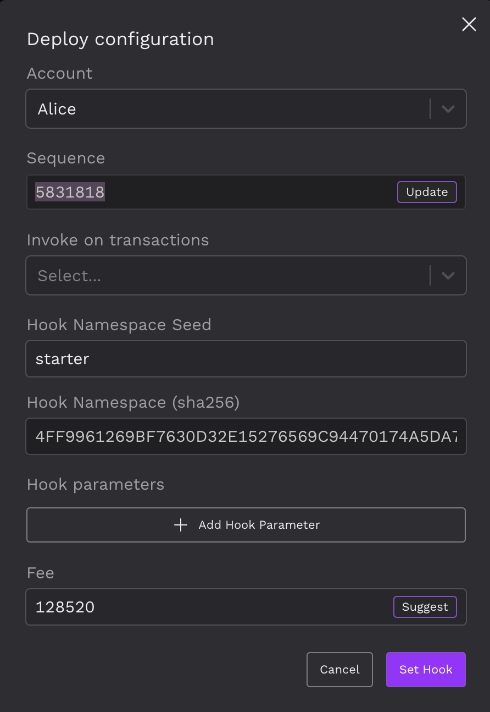

# Hooks 개발

이번 장에서는 Hooks를 개발하는 방법에 대해 설명합니다. 이를 위해, 먼저 Hooks를 개발하기 위한 환경인 hooks builder를 소개하고, 그 환경에서 Hooks를 개발하는 방법을 설명합니다.

Hooks 개발에 필요한 자료들은 전부 [이 링크](https://xrpl-hooks.readme.io/)에 있습니다.

## 1. Hooks Builder

### 1.1 Hooks Builder란?

Hooks Builder는 웹 브라우저 상에서 Hook을 개발, 테스트, 디버그, 배포할 수 있는 온라인 IDE입니다. 특별히 설치할 필요 없이 웹어셈블리(WebAssembly) 기반으로 동작하며, 사용자가 직접 Hook을 처음부터 개발하거나 제공된 예시를 활용할 수 있습니다.

**주요 특징:**

- **설치 없음**: 별도의 설치나 설정 과정 없이 웹 브라우저에서 직접 개발을 시작할 수 있습니다.
- **웹어셈블리 기반**: 웹어셈블리 기술을 활용하여 빠르고 안정적인 개발 환경을 제공합니다.
- **코드 힌팅 및 문서 통합**: 코드 작성 시 자동으로 힌트와 문서를 제공하여 사용자의 개발 효율성을 높입니다.
- **Gist 통한 저장 및 공유**: 개발한 Hook 코드를 Gist를 통해 손쉽게 저장하고 공유할 수 있습니다.
- **브라우저 내 테스트, 디버그 및 배포**: Hooks Builder를 사용하면 웹 브라우저 상에서 직접 Hook의 테스트, 디버그, 배포 과정을 처리할 수 있습니다.

Hooks Builder를 활용하면, 테스트넷에서의 Hook 개발 프로세스가 더욱 간편하고 효과적으로 진행됩니다.

[이 링크](https://hooks-builder.xrpl.org/develop)를 이용하면 hooks builder를 이용할 수 있습니다.

### 1.2 Hooks Builder 사용법

1. **Hooks Builder 접속**

   [이 링크](https://hooks-builder.xrpl.org/develop)를 통해 Hooks Builder에 접속합니다.

2. **프로젝트 선택**

   Hooks builder에서 제공하는 예제 프로젝트 중 하나를 선택하거나 새로운 프로젝트를 생성합니다. 새 프로젝트 생성 시에도 hookapi를 사용하기 위해 starter project를 선택하는 것을 추천합니다.

   

3. **코드 작성 및 컴파일**

   `Develop` 탭에서 Hooks Builder에서 제공하는 코드 힌트를 참고하여 코드를 작성합니다. 코드 작성이 완료되면, `Compile` 버튼을 클릭하여 컴파일을 진행합니다.

   

4. **계정 생성 및 Hook Deploy**

   `Deploy` 탭에서 계정을 생성하거나 import 한 후, 계정 옆의 `Set Hook` 버튼을 클릭하여 계정에 Hook을 deploy합니다.

   

   

5. **테스트 및 디버깅**

   `Test` 탭에서 원하는 트랜잭션을 Hook 계정으로 보내 테스트를 진행합니다. 테스트 과정에서 발생하는 로그를 확인하여 디버깅을 진행합니다.

   

## 2. Hook API

### 2.1 Hook API란?

Hook API는 Hook 개발에 필요한 기능을 제공하는 라이브러리입니다. Hook API를 활용하면, Hook 개발 과정에서 필요한 다양한 기능을 간편하게 사용할 수 있습니다. hookapi는 builder의 예제 프로젝트들에 있으므로 해당 파일들을 프로젝트 디렉토리에 위치시킨 후, `#include "hookapi.h"`를 통해 hookapi를 사용할 수 있습니다.

### 2.2 Hook API 규칙 (Conventions)

Hook API를 효과적으로 사용하려면 몇 가지 핵심 규칙을 이해하고 따라야 합니다. 아래에 이 규칙들을 간단하게 나열하였습니다.

1. **네이밍 규칙**

   모든 Hook API는 특정한 네이밍 규칙을 따릅니다. 이는 API의 함수 이름을 통해 그 기능을 쉽게 파악할 수 있도록 도와줍니다.

   **구조**: `namespace*[noun #1]*[verb]\_[noun #2]`

   - 첫 번째 명사가 누락되면 네임스페이스와 동일하게 간주됩니다.
   - 동사가 누락되면 기본적으로 get으로 간주됩니다.

   **예시**:

   - `state()`는 hook의 상태를 가져온다는 의미입니다.
   - `state_set()`는 hook 상태를 설정한다는 의미입니다.
   - `state_foreign()`는 외부 hook의 상태를 가져온다는 의미입니다.

2. **메모리 관리**

   각 Hook는 독립적인 스택 프레임 내에서 실행됩니다. 따라서 모든 작업 메모리는 이 스택 프레임 내에서 관리되어야 합니다. 힙과 동적 메모리 할당을 사용할 수 없습니다.

3. **통신 규칙**

   Hook이 xrpld와 통신할 때는 정수 값만 전달할 수 있습니다. 이 정수 값은 대체로 Hook의 메모리 내 포인터를 나타냅니다.

4. **허용된 함수**

   Hook 내에서는 `hook()`와 `cbak()` 두 가지 함수만 사용할 수 있습니다. 다른 함수를 사용하려면 API 문서를 참조하시기 바랍니다.

5. **매개변수 전달**

   Hook API 함수에 전달되는 모든 매개변수는 특정 타입을 따르며, 특별한 순서로 배열되어야 합니다.

   - 허용되는 데이터 타입: `uint32_t`, `int32_t`, `uint64_t`, `int64_t`

     - 대부분의 경우, 이들은 Hook의 스택 프레임 내의 포인터나 버퍼의 길이를 나타냅니다.

   - 매개변수 순서:

     1. 쓰기 포인터(있을 경우)
     2. 쓰기 길이(있을 경우)
     3. 읽기 포인터(있을 경우)
     4. 읽기 길이(있을 경우)
     5. 특정 필드나 기타 매개변수(있을 경우)

6. **반환 코드**

   모든 Hook API는 signed integer를 반환합니다. 이 반환 코드는 함수 호출의 성공 또는 실패, 그리고 다양한 오류 상황을 나타내기 위해 사용됩니다.

### 2.3 Hook API 함수

Hook API에는 다양한 함수가 있지만, 여기서는 그 중 핵심적인 함수에 대해 간단히 소개하고자 합니다. 모든 Hook API 함수에 대한 상세한 내용은 [이 링크](https://xrpl-hooks.readme.io/reference/)에서 확인할 수 있습니다.

#### **1. `hook` 함수**

- **개요**: `hook`은 사용자가 정의하는 주요 함수로, xrpld에 의해 호출되어 hook을 실행시킵니다.

- **동작 방식**:

  - `hook`은 원래의 트랜잭션을 수락하거나 거부하기 위해 `accept` 또는 `reject` 함수를 호출합니다.
  - 함수의 실행이 끝날 때까지 어떠한 반환 값도 없다면, 암시적으로 `accept`로 간주됩니다.

- **정의**:

```c
int64_t hook (uint32_t reserved);
```

- **예시**:

```c
int64_t hook(uint32_t reserved)
{
  return 0;
}
```

- **매개변수**:

  - **이름**: `reserved`
    - **타입**: `uint32_t`
    - **설명**: 향후 사용을 위해 예약된 매개변수.

- **반환 코드**:
  - **타입**: `int64_t`
  - **설명**: Hook에서 반환하고자 하는 임의의 반환 코드입니다. 이 코드는 원래의 트랜잭션 메타데이터에 포함됩니다.

이 `hook` 함수는 Hook 개발의 기본이 되는 중요한 함수입니다. 개발자는 이 함수를 통해 트랜잭션의 동작을 제어하고, 원하는 로직에 따라 트랜잭션을 수락하거나 거부할 수 있습니다.

#### **2. `cbak` 함수**

- **개요**: `cbak`은 사용자가 정의하는 콜백 함수로, 이전에 전송된 트랜잭션의 상태에 대해 hook에 알려주기 위해 xrpld에 의해 호출됩니다.

- **동작 방식**:

  - `cbak`은 상태 변경과 추가적인 `emit` 호출을 할 수 있지만, 이미 수행된 트랜잭션을 롤백하는 것은 불가능합니다.
  - `cbak`이 실행될 때, 콜백이 관련된 트랜잭션이 이제 원래의 트랜잭션으로 간주됩니다.

- **정의**:

```c
int64_t cbak (uint32_t what);
```

- **예시**:

```c
int64_t cbak(uint32_t what)
{
    return 0;
}
```

- **매개변수**:

  - **이름**: `what`
    - **타입**: `uint32_t`
    - **설명**:
      - 값이 0이면: 이 콜백과 관련된 전송된 트랜잭션이 성공적으로 원장에 수용되었습니다.
      - 값이 1이면: 콜백과 관련된 전송된 트랜잭션이 만료되기 전에 성공적으로 원장에 수용되지 않았습니다.

- **반환 코드**:
  - **타입**: `int64_t`
  - **설명**: Hook에서 반환하고자 하는 임의의 반환 코드입니다. 이 코드는 원래의 트랜잭션 메타데이터에 포함됩니다.

`cbak` 함수를 통해 개발자는 이전에 전송된 트랜잭션의 상태를 파악하고, 그에 따른 추가적인 작업을 수행할 수 있습니다.

#### **3. `emit` 함수**

- **개요**: `emit`은 hook에서 새로운 트랜잭션을 전송하기 위한 함수입니다.

- **동작 방식**:

  - `read_ptr`로부터 트랜잭션을 읽습니다.
  - 전송 규칙에 따라 트랜잭션의 유효성을 검증합니다.
  - 유효한 경우, 트랜잭션을 합의에 포함시킵니다.
  - `write_ptr`에 정규화된 트랜잭션 해시를 작성합니다.

- **정의**:

```c
int64_t emit (
    uint32_t write_ptr,
    uint32_t write_len,
    uint32_t read_ptr,
    uint32_t read_len
);
```

- **예시**:

```c
if (emit(tx, tx_len) < 0)
    rollback("Failed to emit!", 15, 1);
```

- **매개변수**:

  - **이름**: `write_ptr`
    - **타입**: `uint32_t`
    - **설명**: 트랜잭션 해시를 쓸 버퍼의 포인터
  - **이름**: `write_len`
    - **타입**: `uint32_t`
    - **설명**: 트랜잭션 해시를 쓸 버퍼의 크기 (32이어야 합니다.)
  - **이름**: `read_ptr`
    - **타입**: `uint32_t`
    - **설명**: 전송할 트랜잭션의 포인터
  - **이름**: `read_len`
    - **타입**: `uint32_t`
    - **설명**: 트랜잭션의 길이

- **반환 코드**:
  - **타입**: `int64_t`
  - **설명**: 성공적인 경우, 작성된 트랜잭션 해시의 바이트 수(32)를 반환하거나:
    - 음수인 경우, 오류:
      - `OUT_OF_BOUNDS`: hook 메모리 밖에 지정된 포인터/길이
      - `PREREQUISITE_NOT_MET`: 먼저 `emit_reserve`를 호출해야 합니다.
      - `TOO_MANY_EMITTED_TXN`: 이전에 호출된 `emit_reserve` 시 약속된 것보다 전송된 트랜잭션의 수가 더 많아졌습니다.
      - `EMISSION_FAILURE`: 전송 규칙에 따라 트랜잭션이 잘못 구성되었습니다.

`emit` 함수를 사용하여 개발자는 특정 조건 하에서 새로운 트랜잭션을 전송할 수 있습니다.

#### **4. `hook_param` 함수**

- **개요**: `hook_param` 함수는 명명된 hook 매개변수의 값을 검색합니다.

- **동작 방식**:

  - `read_ptr`에 지정된 명명된 매개변수의 값을 조회합니다.
  - 매개변수의 값을 `write_ptr`에 작성합니다.

- **정의**:

```c
int64_t hook_param (
    uint32_t write_ptr,
    uint32_t write_len,
    uint32_t read_ptr,
    uint32_t read_len
);
```

- **예시**:

```c
uint8_t pname[] = {0xCAU, 0xFEU};
uint8_t pvalue[32];
int64_t value_len =
    hook_param(pvalue, 32, pname, 2);
```

- **매개변수**:

  - **이름**: `write_ptr`
    - **타입**: `uint32_t`
    - **설명**: 출력값을 저장하기 위한 적절한 크기의 버퍼에 대한 포인터. 최소 32 바이트여야 합니다.
  - **이름**: `write_len`
    - **타입**: `uint32_t`
    - **설명**: 출력 버퍼의 길이.
  - **이름**: `read_ptr`
    - **타입**: `uint32_t`
    - **설명**: 매개변수 이름이 포함된 버퍼에 대한 포인터.
  - **이름**: `read_len`
    - **타입**: `uint32_t`
    - **설명**: 매개변수 이름의 길이.

- **반환 코드**:
  - **타입**: `int64_t`
  - **설명**: 작성된 바이트의 수.
    - 음수인 경우, 오류:
      - `OUT_OF_BOUNDS`: hook 메모리 밖에 지정된 포인터/길이.
      - `DOESNT_EXIST`: 지정된 매개변수가 존재하지 않거나 null입니다.
      - `TOO_SMALL`: 매개변수 이름은 null일 수 없습니다.
      - `TOO_BIG`: 매개변수 이름이 32 바이트보다 큽니다.

`hook_param` 함수를 사용하면 hook에 설정된 특정 매개변수의 값을 쉽게 검색할 수 있습니다.

#### **5. `state_set` 함수**

- **개요**: `state_set` 함수는 주어진 키와 값에 대한 Hook 상태를 설정합니다.

- **동작 방식**:

  - `kread_ptr`에서 32 바이트 Hook 상태 키를 읽습니다.
  - `read_ptr`에서 임의의 양의 데이터(값)를 읽습니다.
  - 그 값을 사용하여 Hook 상태 키를 업데이트합니다.

- **정의**:

```c
int64_t state_set (
    uint32_t read_ptr,
    uint32_t read_len,
    uint32_t kread_ptr,
    uint32_t kread_len
);
```

- **예시**:

```c
#define SBUF(str) (uint32_t)(str), sizeof(str)
if (state_set(SBUF(vault), SBUF(vault_key)) < 0)
		rollback(SBUF("Error: could not set state!"), 1);
```

- **매개변수**:

  - **이름**: `read_ptr`
    - **타입**: `uint32_t`
    - **설명**: Hook 상태에 작성할 데이터(값)에 대한 포인터입니다. 0(null)인 경우 해당 키의 데이터를 삭제합니다. null일 수 있습니다.
  - **이름**: `read_len`
    - **타입**: `uint32_t`
    - **설명**: 데이터의 길이. 0(null)인 경우 해당 키의 데이터를 삭제합니다. null일 수 있습니다.
  - **이름**: `kread_ptr`
    - **타입**: `uint32_t`
    - **설명**: 값을 저장할 Hook 상태 키에 대한 포인터.
  - **이름**: `kread_len`
    - **타입**: `uint32_t`
    - **설명**: 키의 길이. 항상 32여야 합니다.

- **주의 사항**:

  - Xrpl은 내부적으로 최대 hook 데이터 크기를 설정합니다. 작성 시점과 공개 테스트넷의 경우 이는 128 바이트로 하드코딩 되어 있지만, 미래에는 검증자가 투표할 수 있는 숫자가 될 것입니다.

- **반환 코드**:
  - **타입**: `int64_t`
  - **설명**: Hook 상태에 작성된 바이트 수(데이터의 길이).
    - 음수인 경우, 오류:
      - `OUT_OF_BOUNDS`: hook 메모리 밖에 지정된 포인터/길이.
      - `TOO_BIG`: `kread_len`이 32보다 크거나 `read_len`이 최대 hook 데이터 크기보다 큼.
      - `TOO_SMALL`: `kread_len`이 0.

`state_set` 함수를 사용하여 Hook 상태의 특정 키에 값을 설정하거나 수정할 수 있습니다.

#### **6. `otxn_field` 함수**

- **개요**: `otxn_field` 함수는 원래의 트랜잭션에서 지정된 sf 필드를 찾아 출력 버퍼에 그 필드의 직렬화된 버전을 작성합니다.

- **동작 방식**:

  - 원래 트랜잭션에서 지정된 sf 필드를 찾습니다.
  - 출력 버퍼에 해당 필드의 직렬화된 버전을 작성합니다.

- **정의**:

```c
int64_t otxn_field (
    uint32_t write_ptr,
    uint32_t write_len,
  	uint32_t field_id
);
```

- **예시**:

```c
int64_t account_field_len =
    otxn_field(account_field, 20, sfAccount);
```

- **매개변수**:

  - **이름**: `write_ptr`
    - **타입**: `uint32_t`
    - **설명**: 출력을 저장하기 위한 적절한 크기의 버퍼에 대한 포인터.
  - **이름**: `write_len`
    - **타입**: `uint32_t`
    - **설명**: 출력 버퍼의 길이.
  - **이름**: `field_id`

    - **타입**: `uint32_t`
    - **설명**: 찾고 있는 필드의 sf 코드.

      예를 들면, sfEmitNonce는 유형이 5이고 필드가 11이므로 그 값은 0x050BU입니다.

- **주요 사항**:

  - 출력 버퍼에는 필드 코드가 작성되지 않으며, 필드의 페이로드만 작성됩니다.
  - Hooks Public Testnet의 작성 시점에서, sfAccount와 같은 STI_ACCOUNT 필드는 선행 변수 길이 바이트 없이 반환됩니다.

- **반환 코드**:
  - **타입**: `int64_t`
  - **설명**: 작성된 바이트 수.
    - 음수인 경우, 오류:
      - `OUT_OF_BOUNDS`: hook 메모리 밖에 지정된 포인터/길이.
      - `TOO_SMALL`: 직렬화된 필드를 저장하기에 출력 버퍼가 충분히 크지 않음.
      - `INVALID_FIELD`: sf field_id가 유효하지 않음.
      - `DOESNT_EXIST`: 원래 트랜잭션에서 해당 필드를 찾을 수 없음.

`otxn_field` 함수를 사용하여 원래의 트랜잭션에서 특정 필드를 검색하고 그 필드의 직렬화된 버전을 가져올 수 있습니다.
